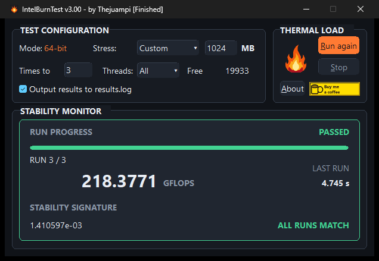
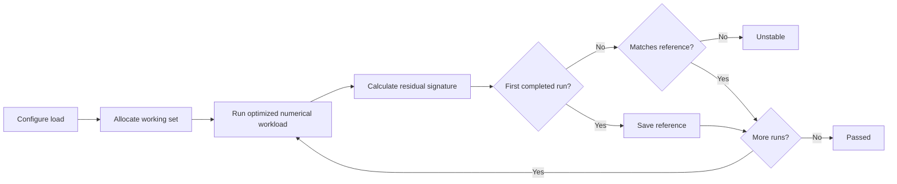
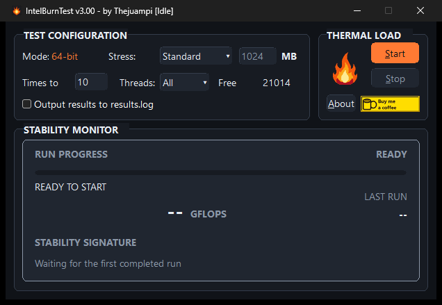
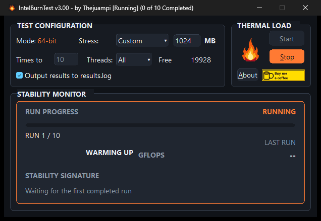

<div align="center">

# IntelBurnTest ASM

**An x86-64 CPU stability test written entirely in assembly and tuned for modern Intel processors.**

[Download v3.0.0](https://github.com/Thejuampi/ibt-asm/releases/download/v3.0.0/IntelBurnTest.exe) · [Release notes](https://github.com/Thejuampi/ibt-asm/releases/tag/v3.0.0) · [Build from source](#build-from-source)

</div>



IntelBurnTest applies a sustained numerical workload across the selected threads and memory footprint. After every completed run, it compares the residual signature with the previous results. Matching signatures indicate repeatable computation under load; a mismatch indicates instability.

The numerical workload, matrix kernels, thread workers, test orchestration, runtime ISA selection, validation, Win32 interface, and optional logging are all implemented in this codebase.

| | |
|---|---|
| **Purpose** | Detect CPU instability under sustained numerical load |
| **Primary target** | Modern Intel x86-64 processors |
| **Execution paths** | SSE2, AVX, and AVX2 selected automatically |
| **Platform** | Windows 10 or 11, x64 |
| **Runtime dependencies** | Standard Windows system libraries only |
| **Persistent output** | Optional `results.log` |

> [!WARNING]
> IntelBurnTest intentionally creates sustained high CPU load, power draw, and heat. Use adequate cooling, monitor temperatures, and stop the test if the system exceeds safe operating limits. A stability test can reveal failures under its workload; it cannot guarantee stability under every possible workload.

## Quick start

1. [Download `IntelBurnTest.exe`](https://github.com/Thejuampi/ibt-asm/releases/download/v3.0.0/IntelBurnTest.exe).
2. Close unnecessary applications and start temperature monitoring.
3. Choose a stress level, run count, and thread count.
4. Enable `results.log` only if you want a persistent record.
5. Select **Start** and watch the Stability Monitor.
6. Treat the test as passed only after every requested run completes with matching residual signatures.

The v3.0.0 executable is unsigned, so Windows SmartScreen may display a warning on first launch.

```text
File:    IntelBurnTest.exe
Size:    26,624 bytes
SHA-256: 08e0152ea34271d823c7327b751314f70453a2f58ae42db5cd96731fe73cc2cc
```

## How stability is determined



The first completed run establishes the reference residual. Each later run must produce the same signature. GFLOPS and elapsed time describe performance; the residual comparison determines consistency.

## Choosing a stress level

| Level | Working set | Typical use |
|---|---:|---|
| **Standard** | 1,024 MB | Initial check and quick iteration |
| **High** | 2,048 MB | Heavier CPU and memory pressure |
| **Very High** | 4,096 MB | Longer tuning and thermal checks |
| **Maximum** | Available memory minus 256 MB | Highest available memory pressure; the system may become unresponsive |
| **Custom** | User-selected | Repeatable testing with an exact memory footprint |

Suggested starting points:

| Scenario | Stress | Runs | Threads | Logging |
|---|---|---:|---|---|
| Quick functional check | Standard | 3 | All | Off |
| CPU tuning iteration | High | 10 | All | On |
| Extended stability run | Very High | 20 or more | All | On |
| Thread-count investigation | Custom | 10 | Selected count | On |

These are examples, not universal pass criteria. Increase duration and memory pressure gradually while watching temperatures, clock behavior, and system responsiveness.

## Reading the Stability Monitor

<table>
  <tr>
    <td align="center"><br><strong>Ready</strong><br>Configure the workload before starting.</td>
    <td align="center"><br><strong>Running</strong><br>Progress and current workload state.</td>
  </tr>
</table>

| State | Meaning |
|---|---|
| **Ready** | No workload is running. |
| **Warming up** | Test data and the first numerical run are being prepared. |
| **Running** | The requested workload is active; no final verdict is available yet. |
| **Passed** | Every requested run completed and the residual signatures matched. |
| **Failure** | A numerical mismatch or unexpected termination was detected. |
| **Stopped** | The user interrupted the test; this is not a stability verdict. |

## Technical design

- Program code written entirely in x86-64 NASM assembly.
- Numerical workload and optimized matrix kernels run in-process.
- SSE2, AVX, and AVX2 capabilities are detected at startup; the best supported path is selected automatically.
- Benchmark data remains in memory during execution.
- No Intel LINPACK executable, MKL, C runtime, or .NET dependency.
- No configuration or theme files are read at startup.
- `results.log` is created only when logging is enabled.
- The release is a single native Windows x64 executable.

## Build from source

### Requirements

- Windows 10 or 11, x64
- [NASM](https://www.nasm.us/)
- Visual Studio 2022 Build Tools with the Windows SDK
- GNU Make
- Python 3 for validation helpers
- Pillow only for graphical asset generation and visual QA
- UPX only for the optional packed release build

Open an **x64 Native Tools Command Prompt for VS 2022**, change to the repository directory, and run:

```console
make
```

The executable is written to `bin/IntelBurnTest.exe`.

Useful targets:

```console
make selftest  # build and run the internal numerical self-test
make visual    # exercise and capture the complete UI state set
make size      # print a routine-level code-size report
make assets    # regenerate icon and bitmap resources
make packed    # create dist/IntelBurnTest.exe using UPX/LZMA
make clean
```

Tool paths can be overridden when necessary:

```console
make NASM=C:\tools\nasm.exe PYTHON=py
```

## Repository layout

```text
ibt.asm             Win64 entry point, state, resources, and shared definitions
ibt_macros.inc      zero-overhead helpers for readable Win64 procedures
ibt_ui.inc          window procedure and application behavior
ibt_theme.inc       custom-control and dark-interface drawing
ibt_lpk.inc         test orchestration and numerical routines
bench_lib.inc       optimized matrix kernels
res/                source and compiled graphical assets
tools/              asset generation, alignment checks, size reports, and QA
```

Ordinary UI and control-flow routines use `PROC_FRAME name, stack, saved...` with `ENDPROC` or `ENDPROC_SAVED` so the Win64 frame contract remains visible. Simple bottom-tested loops use `DO` / `WHILE jcc`; numerical kernels remain direct instructions and labels.

## Frequently asked questions

### Does a high GFLOPS result mean the system is stable?

No. GFLOPS measures throughput. Stability is determined by completing the requested runs with matching residual signatures.

### Does a passed run guarantee complete system stability?

No single stress test can cover every instruction mix, workload, temperature, or power transient. Use IntelBurnTest as one strong signal alongside the real workloads that matter to your system.

### Does the application read or write files while testing?

The workload runs in memory. No configuration or theme files are read. The only optional persistent output is `results.log`, created when its checkbox is enabled.

### Why does the system become difficult to use at Maximum?

Maximum reserves nearly all currently available memory and drives the selected CPU threads continuously. This is expected; use a smaller stress level if you need the machine to remain responsive.

## Credits

IntelBurnTest v3.0.0 was created by **Thejuampi**. IntelBurnTest 2.54 was created by **AgentGOD**.

[Buy Thejuampi a coffee](https://buymeacoffee.com/thejuampi)

No license is granted unless a license file is added explicitly.
